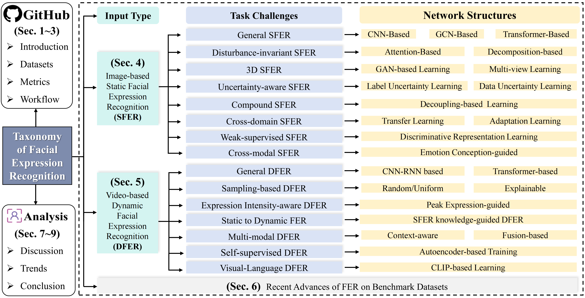
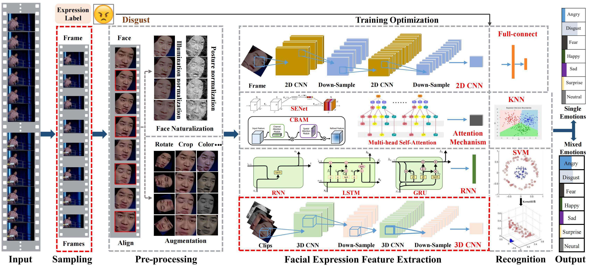
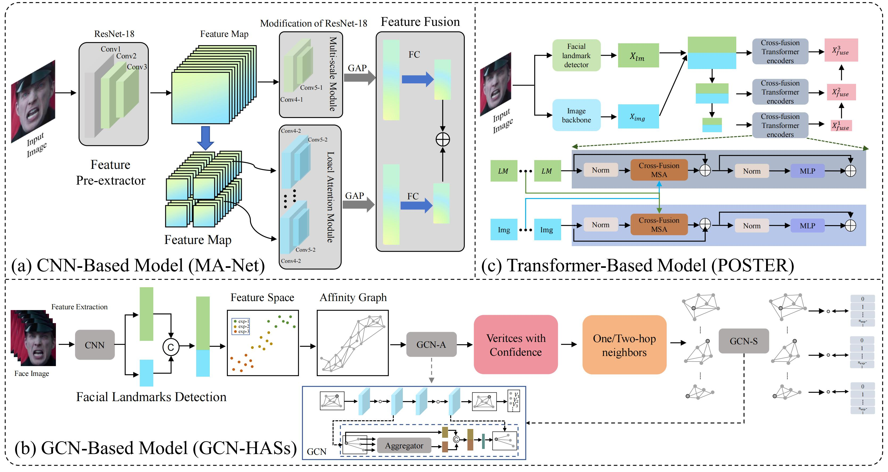
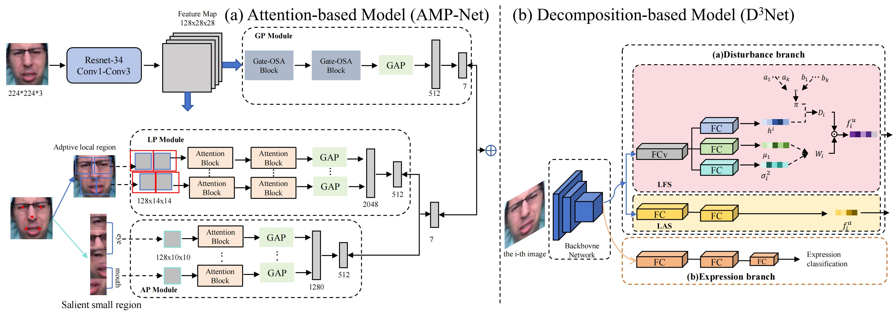
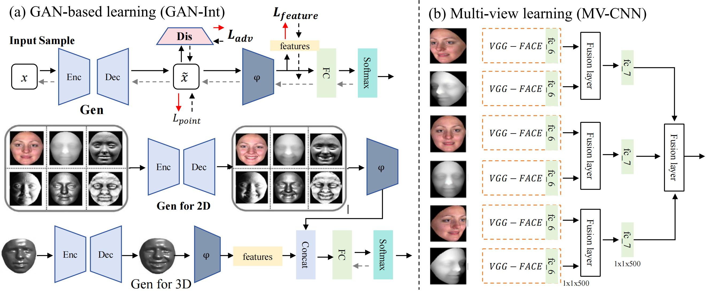
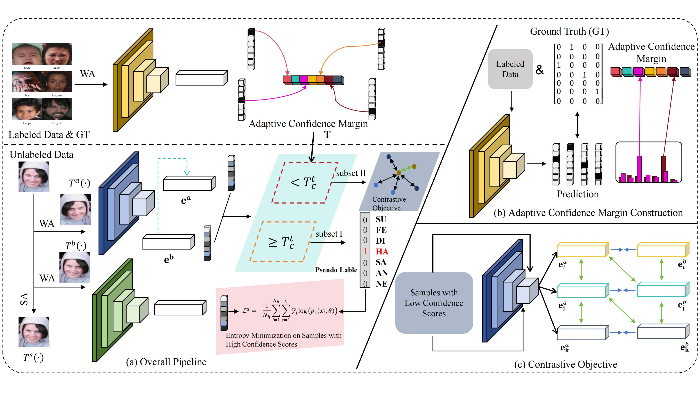
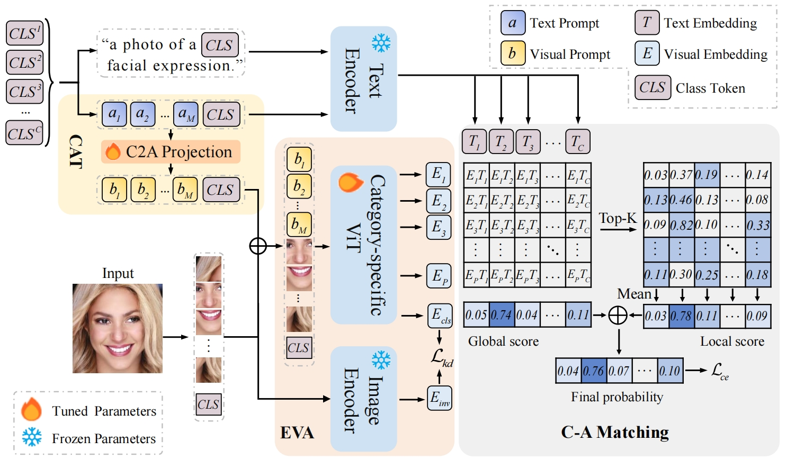
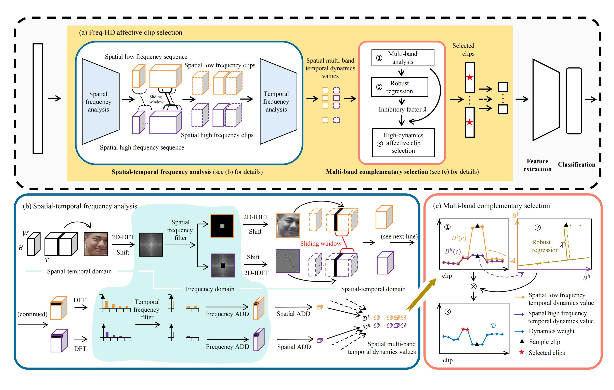
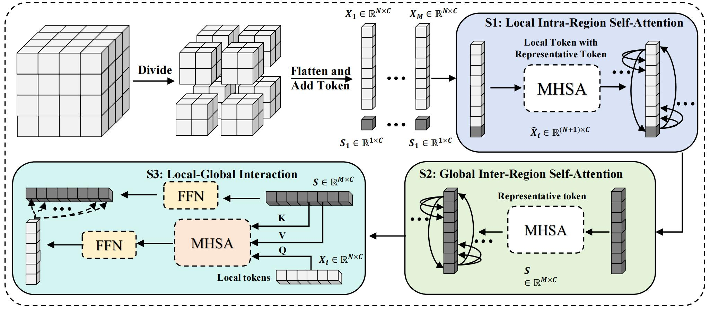
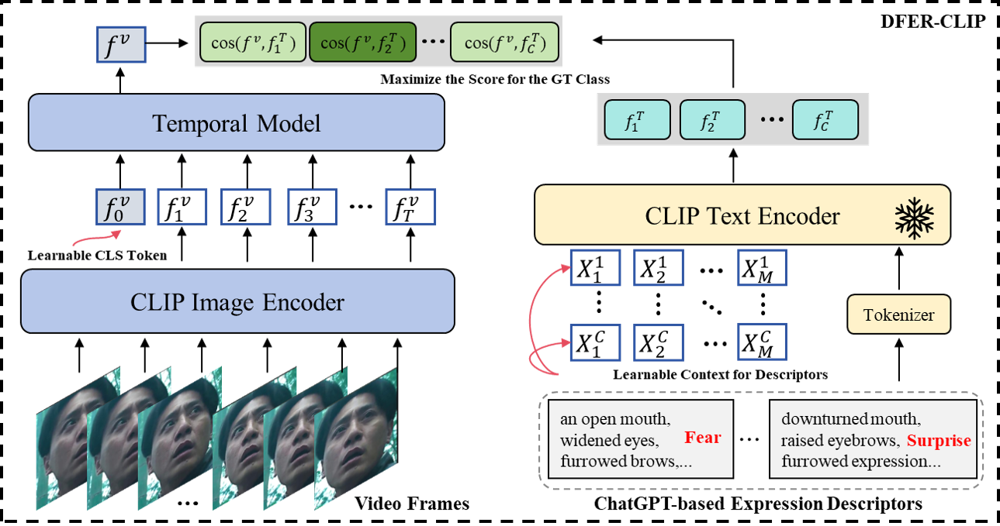

# A Survey on Facial Expression Recognition of Static and Dynamic Emotions

This is the official repository for our [paper](https://arxiv.org/pdf/2408.15777) entitled *“A Survey on Facial Expression Recognition of Static and Dynamic Emotions”*.

## Taxonomy Overview



Taxonomy of FER of static and dynamic emotions. We present a hierarchical taxonomy that categorizes existing FER models by input type, task challenges, and network structures within a systematic framework, aiming to provide a comprehensive overview of the current FER research landscape. First, we have introduced datasets, metrics, and workflow (including literature and codes) into a public GitHub repository. Then, image-based SFER and video- based DFER overcome different task challenges using various learning strategies and model designs. Following, we analyzed recent advances of FER on benchmark datasets. Finally, we discussed and concluded some important issues and potential trends in FER, highlighting directions for future developments.

## Comparisons with SOTA FER-related reviews


## Datasets


Image-based static facial frames (Above) and video-based dynamic facial sequences (Below) of seven basic emotions in the lab and wild. Samples are from (a) JAFFE, (b) CK+, (c) SFEW, (d) ExpW, (e) RAF-DB, (f) AffectNet, (g) EmotioNet, (h) CK+, (i) Oulu-CASIA, (j) DFEW, (k) FERV39k, and (l) MAFW.

| **Categories**                |              | **Datasets**                                                                                       | **Year** | **ECT** | **Emotion**          | **Training Numbers** | **Testing Numbers** |
| ----------------------------- | ------------ | -------------------------------------------------------------------------------------------------- | -------- | ------- | -------------------- | -------------------- | ------------------- |
| **Modality**                  | **Scene**    |                                                                                                    |          |         |                      |                      |                     |
| **Image-based SFER Datasets** | **Lab**      | [JAFFE](http://www.kasrl.org/jaffe.html)                                                           | 1998     | P       | Sev                  | 213                  | 213                 |
|                               |              | [CK+](http://vasc.ri.cmu.edu/idb/html/face/facial_expression/)                                     | 2010     | P/I     | Sev                  | 241                  | 241                 |
|                               |              | [MMI](https://mmifacedb.eu/)                                                                       | 2010     | P       | Sev                  | 370                  | 370                 |
|                               |              | [Oulu-CASIA](http://www.cse.oulu.fi/CMV/Downloads/Oulu-CASIA)                                      | 2011     | P       | Sev                  | 720                  | 240                 |
|                               |              | [RaFD](https://rafd.socsci.ru.nl/?p=main)                                                          | 2010     | P       | Sev, C               | 1,448                | 160                 |
|                               | **Wild**     | [FER-2013](https://medium.com/@birdortyedi_23820/deep-learning-lab-episode-3-fer2013-c38f2e052280) | 2013     | P/I     | Sev                  | 28,709               | 3,589               |
|                               |              | [SFEW 2.0](https://cs.anu.edu.au/few/)                                                             | 2011     | P/I     | Sev                  | 958                  | 436                 |
|                               |              | [EmotioNet](http://www.pitt.edu/~emotion/downloads.html)                                           | 2016     | P/I     | Sev, C               | 80,000               | 20,000              |
|                               |              | [RAF-DB](http://www.whdeng.cn/raf/model1.html)                                                     | 2017     | P/I     | Sev, Com             | 12,271               | 3,068               |
|                               |              | [AffectNet](http://mohammadmahoor.com/affectnet/)                                                  | 2017     | P/I     | Sev, Con.            | 283,901              | 3,500               |
|                               |              | [ExpW](https://mmlab.ie.cuhk.edu.hk/projects/socialrelation/index.html)                            | 2017     | P/I     | Sev                  | 75,048               | 16,745              |
|                               | **Lab (3D)** | [BU-3DFE](https://www.cs.binghamton.edu/~lijun/Research/3DFE/3DFE_Analysis.html)                   | 2006     | P       | Sev                  | 2,000                | 500                 |
|                               |              | [Bosphorus](http://bosphorus.ee.boun.edu.tr/)                                                      | 2008     | P       | Sev                  | 2,326                | 2,326               |
|                               |              | [4DFAB](https://ibug.doc.ic.ac.uk/resources/4dfab/)                                                | 2018     | P/I     | Sev                  | 1,440k               | 360k                |
| **Video-based DFER Datasets** | **Lab**      | [CK+](http://vasc.ri.cmu.edu/idb/html/face/facial_expression/)                                     | 2010     | P/I     | Sev                  | 241                  | 241                 |
|                               |              | [MMI](https://mmifacedb.eu/)                                                                       | 2010     | P/I     | Sev                  | 1,450                | 1,450               |
|                               |              | [Oulu-CASIA](http://www.cse.oulu.fi/CMV/Downloads/Oulu-CASIA)                                      | 2011     | P       | Six                  | 2,160                | 720                 |
|                               | **Wild**     | [AFEW 8.0](https://cs.anu.edu.au/few/AFEW.html)                                                    | 2011     | P/I     | Sev                  | 773                  | 383                 |
|                               |              | [CAER](https://caer-dataset.github.io/)                                                            | 2019     | P/I     | Sev                  | 9,240                | 2,640               |
|                               |              | [DFEW](https://dfew-dataset.github.io/)                                                            | 2020     | P/I     | Sev                  | 12,000               | 3,000               |
|                               |              | [FERV39k](https://wangyanckxx.github.io/Proj_CVPR2022_FERV39k.html)                                | 2022     | P/I     | SE                   | 35,887               | 3,000               |
|                               |              | [MAFW](https://mafw-database.github.io/MAFW/)                                                      | 2022     | P/I     | Sev, C, A, D, H, Com | 8,036                | 2,009               |

Summary of the in-the-lab or in-the-wild datasets with static and dynamic emotions for FER training and evaluation. ECT: Elicitation; P: Posed; I: Instinctive; Sev: Seven Emotions (Happy, Angry, Surprise, Fear, Sad, Disgust, Neutral); C: Contempt; A: Anxiety;  D: Disappointment; H: Helplessness; Com: Compound.

## Workflow of Generic Facial Expression Recognition



The workflow and main components of generic facial expression recognition.

## Image-based Static FER

Image-based static facial expression recognition (SFER) involves extracting features from a single image, which captures complex spatial information that related to facial expressions, such as landmarks, and their geometric structures and relationships. In the following, we will first introduce the general architecture of SFER, and then elaborate specific design of SFER methods from the challenge-solving perspectives, including disturbance-invariant SFER, 3D SFER, uncertainty-aware SFER, compound SFER, cross-domain SFER, limited-supervised SFER, and cross-modal SFER.

### General SFER



The architecture of general SFER. Figure is reproduced based on (a) CNN-based model, (b) GCN-based model, and (c) Transformer-based model.

### Disturbance-invariant SFER



The architecture of disturbance-invariant SFER. Figure is reproduced based on (a) Attention-based model (AMP-Net) and (b) Decomposition-based model.

### 3D SFER



The architecture of 3D SFER. Figure is reproduced based on (a) GAN-based learning (GAN-Int) and (b) Multi-view learning (MV-CNN).

### Uncertainty-aware SFER


The architecture of uncertainty-aware SFER. Figure is reproduced based on (a) the label uncertainty learning (LA-Net) and (b) data uncertainty learning (LNSU-Net).

### Compound SFER

Compound emotions refer to complex emotional states formed by the combination of at least two basic emotions, which are not independent, discrete categories but exist within a continuous emotional spectrum composed of multiple dimensions. Compared with discrete "basic" emotions or a few dimensions, compound emotions provide a more accurate representation of the diversity and continuity of human complex emotions.

### Cross-domain SFER


The architecture of cross-domain SFER. Figure is reproduced based on (a) the transfer learning-based model (CSRL) and (b) the adaption learning-based model (AGRA).

### Weak-supervised SFER



The architecture of weak-supervised SFER. Figure is reproduced based on the Ada-CM.

### Cross-modal SFER



The architecture of cross-modal SFER. Figure is reproduced based on the CEprompt.

## Video-based Dynamic Facial Expression Recognition

The video-based DFER involves analyzing facial expressions that change over time, necessitating a framework that effectively integrates spatial and temporal information. The core objective of DFER is to extract and learn the features of expression changes from video sequences or image sequences. Due to the complexity and diversity of input video or image sequences, DFER faces various task challenges. Based on different solution approaches, these challenges can be categorized into seven basic types: general DFER, sampling-based DFER, expression intensity-aware DFER, multi-modal DFER, static to dynamic FER, self-supervised DFER, and cross-modal DFER.

### General DFER


The architecture of general DFER. Figure is reproduced based on (a) CNN-RNN based model (SAANet) and (b) the transformer-based model (EST).

### Sampling-based DFER



The architecture of sampling-based DFER. Figure is reproduced based on explainable sampling (Freq-HD).

### Expression Intensity-aware DFER

Facial expressions are inherently dynamic, with intensity either gradually shifting from neutral to peak and back or abruptly transitioning from peak to neutral, making the accurate capture of these fluctuations essential for understanding expression dynamics.

### Static to Dynamic FER

The static to dynamic FER utilized the high-performance SFER knowledge to explore appearance features and dynamic dependencies.

### Multi-modal DFER


The architecture of multi-modal DFER. Figure is reproduced based on the fusion-based model (T-MEP).

### Self-supervised DFER



The architecture of self-supervised DFER. This is reproduced based on the MAE-DFER.

### Visual-Language DFER



The architecture of vision-language DFER. Figure is reproduced based on DFER-CLIP.

## RECENT ADVANCES OF FER ON BENCHMARK DATASETS

Performance (WAR) of image-based SFER and video-based DFER methods on four in-the-lab datasets：

| **Method**                                              | **Year** | **Type** | **Backbone** | **MMI** | **CK+** | **Oulu-CASIA** |
| ------------------------------------------------------- | -------- | -------- | ------------ | ------- | ------- | -------------- |
| [IL-VGG](https://doi.org/10.1109/CVPR.2018.00392)       | 2018     | Static   | VGG-16       | 74.68   | 91.64   | 84.58          |
| [FMPN](https://doi.org/10.1109/ICCVW.2019.00132)        | 2019     | Static   | CNNs         | 82.74   | 98.60   | -              |
| [LDL-ALSG](https://doi.org/10.1109/TPAMI.2020.3011051)  | 2020     | Static   | ResNet-50    | 70.03   | 93.08   | 63.94          |
| [IE-DBN](https://doi.org/10.1109/ACCESS.2020.3009927)   | 2021     | Static   | VGG-16       | -       | 96.02   | 85.21          |
| [im-cGAN](https://doi.org/10.1016/j.patcog.2023.109157) | 2023     | Static   | GAN          | -       | 98.10   | 93.34          |
| [Mul-DML](https://doi.org/10.1016/j.patcog.2024.110711) | 2024     | Static   | ResNet-18    | 81.57   | 98.47   | -              |
| [STC-NLSTM](https://doi.org/10.1109/TCSVT.2018.2808918) | 2018     | Dynamic  | 3DCNN        | 84.53   | 99.80   | 93.45          |
| [SAANet](https://doi.org/10.1109/TPAMI.2020.2977029)    | 2020     | Dynamic  | VGG-16       | -       | 97.38   | 82.41          |
| [MGLN](https://doi.org/10.1016/j.patcog.2020.107899)    | 2020     | Dynamic  | VGG-16       | -       | 98.77   | 90.40          |
| [MSDmodel](https://doi.org/10.1109/TCSVT.2021.3050862)  | 2021     | Dynamic  | CNN          | 89.99   | 99.10   | 87.33          |
| [DPCNet](https://doi.org/10.1109/TCSVT.2022.3200827)    | 2022     | Dynamic  | CNN          | -       | 99.70   | -              |
| [STACM](https://doi.org/10.1109/ICCV.2023.01297)        | 2023     | Dynamic  | CNN          | 82.71   | 99.08   | 91.25          |

Performance (WAR) of image-based SFER methods on three in-the-wild datasets：

| **Task Challenges**            | **Method**                                                | **Year** | **Backbone** | **SFEW** | **RAF-DB** | **AffectNet** |
| ------------------------------ | --------------------------------------------------------- | -------- | ------------ | -------- | ---------- | ------------- |
| **General SFER**               | [IFSL](https://doi.org/10.1109/TPAMI.2020.3011051)        | 2020     | VGG16        | 46.50    | 76.90      | -             |
|                                | [OAENet](https://doi.org/10.1109/TPAMI.2021.3061452)      | 2021     | VGG16        | -        | 86.50      | 58.70         |
|                                | [MA-Net](https://doi.org/10.1109/ICCV.2021.01132)         | 2021     | ResNet18     | -        | 88.40      | 64.53         |
|                                | [D³Net](https://doi.org/10.1109/TPAMI.2021.3081864)       | 2021     | ResNet18     | 62.16    | 88.79      | -             |
|                                | [TransFER](https://doi.org/10.1109/TPAMI.2021.3095067)    | 2021     | ResNet50     | -        | 90.91      | 66.23         |
|                                | [VTFF](https://doi.org/10.1109/TCSVT.2023.3245789)        | 2023     | Transformer  | -        | 88.14      | 61.85         |
|                                | [HASs](https://doi.org/10.1109/TPAMI.2023.3231279)        | 2023     | ResNet50     | 65.14    | 91.04      | -             |
|                                | [APViT](https://doi.org/10.1109/CVPR.2023.00129)          | 2023     | Transformer  | 61.92    | 91.98      | 66.91         |
|                                | [POSTER](https://doi.org/10.1109/TPAMI.2023.3199651)      | 2023     | CNN-IR50     | -        | 92.05      | 67.31         |
|                                | [MGR³Net](https://doi.org/10.1109/ICCV.2024.00098)        | 2024     | ResNet50     | -        | 91.05      | 66.36         |
| **Disturbance-invariant SFER** | [PG-Unit](https://doi.org/10.1109/CVPR.2018.00129)        | 2018     | VGG16        | -        | 83.27      | 55.33         |
|                                | [IDFL](https://doi.org/10.1109/ICPR.2021.00510)           | 2021     | ResNet50     | -        | 86.96      | 59.20         |
|                                | [FDRL](https://doi.org/10.1109/TCSVT.2021.3094517)        | 2021     | ResNet18     | 62.16    | 89.47      | -             |
|                                | [AMP-Net](https://doi.org/10.1109/TPAMI.2022.3134727)     | 2022     | ResNet50     | -        | 88.06      | 63.23         |
|                                | [PACVT](https://doi.org/10.1109/TCSVT.2023.3187925)       | 2023     | ResNet18     | -        | 88.21      | 60.68         |
|                                | [IPD-FER](https://doi.org/10.1109/ICCV.2023.00127)        | 2023     | ResNet18     | 58.43    | 88.89      | -             |
|                                | [Latent-OFER](https://doi.org/10.1109/TPAMI.2023.3199886) | 2023     | ResNet18     | -        | 89.60      | -             |
|                                | [RAC+RSL](https://doi.org/10.1109/TPAMI.2024.3231457)     | 2023     | ResNet18     | -        | 89.77      | 62.16         |
| **Uncertainty-aware SFER**     | [SCN](https://doi.org/10.1109/TPAMI.2020.3015210)         | 2020     | ResNet18     | -        | 87.03      | 60.23         |
|                                | [DMUE](https://doi.org/10.1109/CVPR.2021.01135)           | 2021     | ResNet18     | 57.12    | 88.76      | 62.84         |
|                                | [RUL](https://doi.org/10.1109/TPAMI.2021.3094501)         | 2021     | ResNet18     | -        | 88.98      | -             |
|                                | [EASE](https://doi.org/10.1109/TCSVT.2022.3206573)        | 2022     | VGG16        | 60.12    | 89.56      | 61.82         |
|                                | [EAC](https://doi.org/10.1109/ICCV.2022.00052)            | 2022     | ResNet18     | -        | 89.99      | 65.32         |
|                                | [LA-Net](https://doi.org/10.1109/TPAMI.2023.3231872)      | 2023     | ResNet18     | -        | 91.56      | 64.54         |
|                                | [LNSU-Net](https://doi.org/10.1109/CVPR.2024.01234)       | 2024     | ResNet18     | -        | 89.77      | 65.73         |
| **Weak-supervised SFER**       | [Ada-CM](https://doi.org/10.1109/ICCV.2022.00341)         | 2022     | ResNet18     | 52.43    | 84.42      | 57.42         |
|                                | [E2E-WS](https://doi.org/10.1109/CVPR.2022.01231)         | 2022     | ResNet18     | 54.56    | 88.89      | 60.04         |
|                                | [DR-FER](https://doi.org/10.1109/TPAMI.2023.3201167)      | 2023     | ResNet50     | -        | 90.53      | 66.85         |
|                                | [WSCFER](https://doi.org/10.1109/CVPR.2023.00147)         | 2023     | IResNet      | -        | 91.72      | 67.71         |
| **Cross-modal SFER**           | [CLEF](https://doi.org/10.1109/ICCV.2023.00341)           | 2023     | CLIP         | -        | 90.09      | 65.66         |
|                                | [VTA-Net](https://doi.org/10.1109/CVPR.2024.00472)        | 2024     | ResNet-18    | -        | 72.17      | -             |
|                                | [CEPrompt](https://doi.org/10.1109/CVPR.2024.00512)       | 2024     | ViT-B/16     | -        | 92.43      | 67.29         |

Performance (Accuracy) of 3D SFER methods on BU-3DE and Bosphorus datasets：

| **Method**                                            | **Year** | **Backbone** | **Modality** | **BU-3DE**  | **Bosphorus** |
| ----------------------------------------------------- | -------- | ------------ | ------------ | ----------- | ------------- |
| [JPE-GAN](https://doi.org/10.1109/TPAMI.2018.2851224) | 2018     | CNN          | 2D/-         | 81.20/-     | -/-           |
| [DA-CNN](https://doi.org/10.1109/TPAMI.2019.2898458)  | 2019     | ResNet50     | -/3D         | -/87.69     | -/-           |
| [GAN-Int](https://doi.org/10.1109/CVPR.2021.00745)    | 2021     | VGGNet16     | 2D+3D/3D     | 88.47/83.20 | -/-           |
| [FFNet-M](https://doi.org/10.1109/TPAMI.2021.3094483) | 2021     | VGGNet16     | 2D+3D/3D     | 89.82/87.28 | 87.65/82.86   |
| [CMANet](https://doi.org/10.1109/ICCV.2022.00129)     | 2022     | VGGNet16     | 2D+3D/3D     | 90.24/84.03 | 89.36/81.25   |
| [DrFER](https://doi.org/10.1109/CVPR.2024.00431)      | 2024     | ResNet18     | -/3D         | -/89.15     | -/86.77       |

Performance (WAR) of cross-domain SFER methods on four widely-used datasets：

| **Method**                                          | **Year** | **Backbone** | **Source Dataset** | **JAFFE** | **CK+** | **FER-2013** | **AffectNet** |
| --------------------------------------------------- | -------- | ------------ | ------------------ | --------- | ------- | ------------ | ------------- |
| [ECAN](https://doi.org/10.1109/TPAMI.2022.3183748)  | 2022     | ResNet50     | RAF-DB             | 57.28     | 79.77   | 56.46        | -             |
| [AGRA](https://doi.org/10.1109/TPAMI.2022.3125671)  | 2022     | ResNet50     | RAF-DB             | 61.5      | 85.27   | 58.95        | -             |
| [PASM](https://doi.org/10.1109/TPAMI.2022.3124456)  | 2022     | VGGNet16     | RAF-DB             | -         | 79.65   | 54.78        | -             |
| [CWCST](https://doi.org/10.1109/TPAMI.2023.3206728) | 2023     | VGGNet16     | RAF-DB2.0          | 69.01     | 89.64   | 57.44        | 52.66         |
| [DMSRL](https://doi.org/10.1109/TPAMI.2023.3210668) | 2023     | VGGNet16     | RAF-DB2.0          | 69.48     | 91.26   | 56.16        | 50.94         |
| [CSRL](https://doi.org/10.1109/TPAMI.2023.3210668)  | 2023     | ResNet18     | RAF-DB             | 66.67     | 88.37   | 55.53        | -             |

Performance (WAR/UAR) of video-based DFER methods on four widely-used datasets. TI: Time Interpolation; DS: Dynamic Sampling; GWS: Group-weighted Sampling. \*: Tunable Param (M)：

| **Task Challenges**                 | **Method**                                                | **Year** | **Sample Strategies** | **Backbone**  | **Complexity (GFLOPs)** | **AFEW (WAR/UAR)** | **DFEW (WAR/UAR)** | **FERV39k (WAR/UAR)** | **MAFW (WAR/UAR)** |
| ----------------------------------- | --------------------------------------------------------- | -------- | --------------------- | ------------- | ----------------------- | ------------------ | ------------------ | --------------------- | ------------------ |
| **General DFER**                    | [TFEN](https://doi.org/10.1109/TPAMI.2021.3058919)        | 2021     | TI                    | ResNet-18     | -                       | -                  | 56.60/45.57        | -                     | -                  |
|                                     | [FormerDFER](https://doi.org/10.1109/CVPR.2021.01234)     | 2021     | DS                    | Transformer   | 9.1G                    | 50.92/47.42        | 65.70/53.69        | -                     | 43.27/31.16        |
|                                     | [EST](https://doi.org/10.1109/TPAMI.2023.3174532)         | 2023     | DS                    | ResNet-18     | N/A                     | 54.26/49.57        | 65.85/53.94        | -                     | -                  |
|                                     | [LOGO-Former](https://doi.org/10.1109/TPAMI.2023.3178672) | 2023     | DS                    | ResNet-18     | 10.27G                  | -                  | 66.98/54.21        | 48.13/38.22           | -                  |
|                                     | [MSCM](https://doi.org/10.1109/CVPR.2023.00489)           | 2023     | DS                    | ResNet-18     | 8.11G                   | 56.40/52.30        | 70.16/58.49        | -                     | -                  |
|                                     | [SFT](https://doi.org/10.1109/TPAMI.2024.3178921)         | 2024     | DS                    | ResNet-18     | 17.52G                  | 55.00/50.14        | -                  | 47.80/35.16           | 47.44/33.39        |
|                                     | [CDGT](https://doi.org/10.1109/CVPR.2024.00561)           | 2024     | DS                    | Transformer   | 8.3G                    | 55.68/51.57        | 70.07/59.16        | 50.80/41.34           | -                  |
|                                     | [LSGTNet](https://doi.org/10.1109/TPAMI.2024.3180426)     | 2024     | DS                    | ResNet-18     | -                       | -                  | 72.34/61.33        | 51.31/41.30           | -                  |
| **Sampling-based DFER**             | [EC-STFL](https://doi.org/10.1109/CVPR.2020.01112)        | 2020     | TI                    | ResNet-18     | 8.32G                   | 53.26/-            | 54.72/43.60        | -                     | -                  |
|                                     | [DPCNet](https://doi.org/10.1109/TPAMI.2022.3090921)      | 2022     | GWS                   | ResNet-50     | 9.52G                   | 51.67/47.86        | 66.32/57.11        | -                     | -                  |
|                                     | [FreqHD](https://doi.org/10.1109/TPAMI.2023.3212345)      | 2023     | FreqHD                | ResNet-18     | -                       | -                  | 54.98/44.24        | 43.93/32.24           | -                  |
|                                     | [M3DFEL](https://doi.org/10.1109/TPAMI.2023.3227845)      | 2023     | DS                    | R3D18         | 1.66G                   | -                  | 69.25/56.10        | 47.67/35.94           | -                  |
| **Expression Intensity-aware DFER** | [CEFL-Net](https://doi.org/10.1109/TPAMI.2022.3109845)    | 2022     | Clip-based            | ResNet-18     | -                       | 53.98/-            | 65.35/-            | -                     | -                  |
|                                     | [NR-DFERnet](https://doi.org/10.1109/TPAMI.2023.3124091)  | 2023     | DS                    | ResNet-18     | 6.33G                   | 53.54/48.37        | 68.19/54.21        | -                     | -                  |
|                                     | [GCA+IAL](https://doi.org/10.1109/TPAMI.2023.3141129)     | 2023     | DS                    | ResNet-18     | 9.63G                   | -                  | 69.24/55.71        | 48.54/35.82           | -                  |
| **Static to Dynamic FER**           | [S2D](https://doi.org/10.1109/TPAMI.2023.3198657)         | 2023     | DS                    | ViT-B/16      | -                       | -                  | 76.03/61.82        | 52.56/41.28           | 57.37/41.86        |
|                                     | [(AEN)](https://doi.org/10.1109/CVPR.2023.00678)          | 2023     | DS                    | Transformer   | -                       | 54.64/50.88        | 69.37/56.66        | 47.88/38.18           | -                  |
| **Multi-modal DFER**                | [T-ESFL](https://doi.org/10.1109/TPAMI.2022.3091254)      | 2022     | DS                    | Transformer   | -                       | -                  | -                  | -                     | 48.18/33.28        |
|                                     | [T-MEP](https://doi.org/10.1109/CVPR.2023.00542)          | 2023     | DS                    | -             | 6G                      | 52.96/50.22        | 68.85/57.16        | -                     | 52.85/39.37        |
|                                     | [OUS](https://doi.org/10.1109/TPAMI.2024.3182374)         | 2024     | DS                    | CLIP          | -                       | 52.96/50.22        | 68.85/57.16        | -                     | 52.85/39.37        |
|                                     | [MMA-DFER](https://doi.org/10.1109/CVPR.2024.01234)       | 2024     | DS                    | Transformer   | -                       | -                  | 77.51/67.01        | -                     | 58.52/44.11        |
| **Self-supervised DFER**            | [MAE-DFER](https://doi.org/10.1109/TPAMI.2023.3174532)    | 2023     | DS                    | ResNet-18     | 50G                     | -                  | 74.43/63.41        | 52.07/43.12           | 54.31/41.62        |
|                                     | [HiCMAE](https://doi.org/10.1109/TPAMI.2024.3187689)      | 2024     | DS                    | ResNet-18     | 32G                     | -                  | 73.10/61.92        | -                     | 54.84/42.10        |
| **Visual-Language DFER**            | [CLIPER](https://doi.org/10.1109/TPAMI.2023.3145632)      | 2023     | DS                    | CLIP-ViT-B/16 | 88M\*                   | 56.43/52.00        | 70.84/57.56        | 51.34/41.23           | -                  |
|                                     | [DFER-CLIP](https://doi.org/10.1109/CVPR.2023.01231)      | 2023     | DS                    | CLIP-ViT-B/32 | 92G                     | -                  | 71.25/59.61        | 51.65/41.27           | 52.55/39.89        |
|                                     | [EmoCLIP](https://doi.org/10.1109/TPAMI.2024.3181789)     | 2024     | DS                    | CLIP-ViT-B/32 | -                       | -                  | 62.12/58.04        | 36.18/31.41           | 41.46/34.24        |
|                                     | [A³lign-DFER](https://doi.org/10.1109/CVPR.2024.01456)    | 2024     | DS                    | CLIP-ViT-L/14 | -                       | -                  | 74.20/64.09        | 51.77/41.87           | 53.22/42.07        |
|                                     | [UMBEnet](https://doi.org/10.1109/TPAMI.2024.3183745)     | 2024     | DS                    | CLIP          | -                       | -                  | 73.93/64.55        | 52.10/44.01           | 57.25/46.92        |
|                                     | [FineCLIPER](https://doi.org/10.1109/TPAMI.2024.3189421)  | 2024     | DS                    | CLIP-ViT-B/16 | 20M\*                   | -                  | 76.21/65.98        | 53.98/45.22           | 56.91/45.01        |

## Citation

If you find our work useful, please cite our paper:

```latex
@article{wang_surveyfer_2024,
       title = {A Survey on Facial Expression Recognition of Static and Dynamic Emotions},
       author = {Wang, Yan and Yan, Shaoqi and Liu, Yang and Song, Wei and Liu, Jing and Chang, Yang and Mai, Xinji and Hu, Xiping and Zhang, Wenqiang and Gan, Zhongxue},
       journal = {arXiv preprint arXiv:2408.15777},
       year = {2024}
}
```

